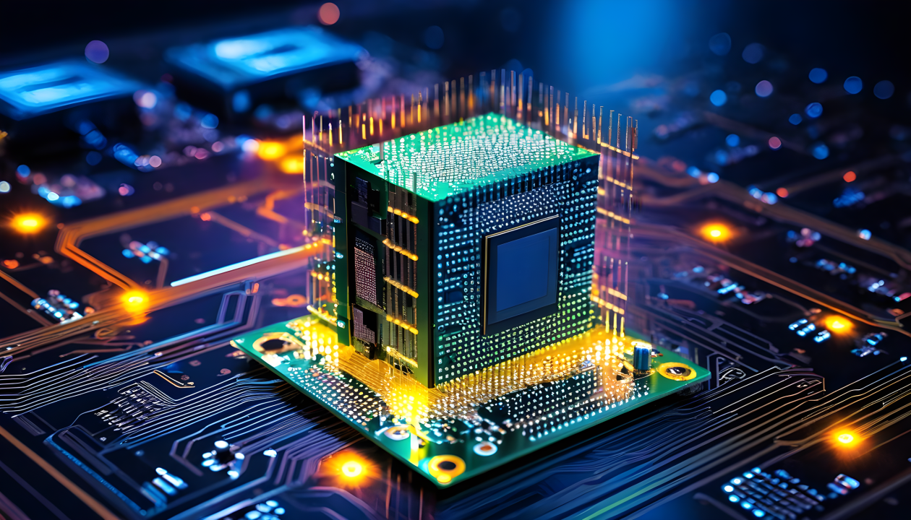

### Ahmed Kamal ElGarnousy

<!-- 

  

 -->

👋 Hi, I am Ahmed Kamal. I am an enthusiastic software engineer with knowledge in embedded systems, Full Stack (MERN) and hardware design domains.

👀 My repository is specialized in these tracks:
- Embedded and Edge Architectures
- Full Stack Development

### My Work Experience Timeline Summary
- 2025-2026. career break (military service)
- 2024-2025. SEITech Intern, Graduation Project
- 2022-2024. participated in Metal Monsters – Combat robot, SUMO, Linefollower Competitions
- 2020-2022. participated in EVER, SHELL, GEVC Racing Competitions.

### 🎯 Core Expertise
- Embedded systems - ARM based Development - RTOS - Automtoive Communication Protocols
- Embedded Linux - Yocto, Kernel Development, Boot Optimization
- Modern C++ - C++14/17/20, Design Patterns, SOLID Principles
- Hardware Design - Power Electronics - PCB Design
- Full Stack Development -  MongoDB - Express.js - React.js - Node.js.

<!-- Your comment here 
### My Skill Set
Programming Language. I'm fluent in speaking embedded C and C++ (especially the modern version like C++11, C++17, and C++20). Also able to speak Python and javascript.
Firmware Architecture Design. A very important step that many engineers missed. Without proper architecture design, your firmware will be destined to be super-hard to maintain and add features.
Firmware Documentation. Without proper documentation, people will waste time to understand and follow your firmware.
[comment]: <> (Firmware Testing. I love and use Test-Driven Development in my day-to-day work.)
[comment]: <> (Testing Automation. Usually I use CI/CD to deliver fast and good firmware without breaking existing code.)

### Technical Skills
- Wired Protocols
  - UART/USART
  - SPI
  - I2C
  - CAN Bus
  - Ethernet
  - USB: (still learning)
- Wireless Protocols
  - WiFi
  - Bluetooth Classic (still Learning)
- Network Protocols
  - TCP/IP
  - UDP/IP
- Microcontroller
  - ESP32 (dual core MCU + WiFi and Bluetooth)
  - ESP8266 (single core MCU + WiFi from Espressif)
  - STM32 F1, F4 series
  - AVR MCU
  - Texas Instrument TivaC
- system programming in linux
- Development Board bring-up
- Embedded Linux (still learning, mainly use Yocto)
- RTOS
  - FreeRTOS
  - Zephyr (still learning)
- Hardware Development
  - Schematic Design
  - PCB design (still learning! I use KiCad)
  - Board assembly
- Electronic Equipment I Own
  - Nice multimeter
  - Logic Analyzer
-->
### How to Contach Me:
- [LinkedIn](www.linkedin.com/in/ahmed-el-garnousy)
- [Gmail](ahmedgarnousy76@gmail.com)
<!---
AhmedElgarnousy/AhmedElgarnousy is a ✨ special ✨ repository because its `README.md` (this file) appears on your GitHub profile.
You can click the Preview link to take a look at your changes.

